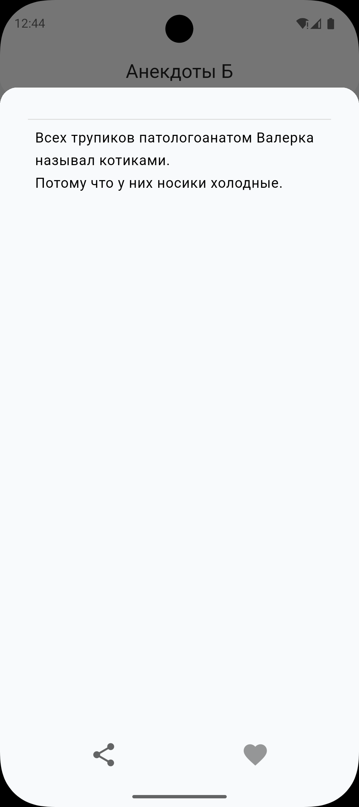
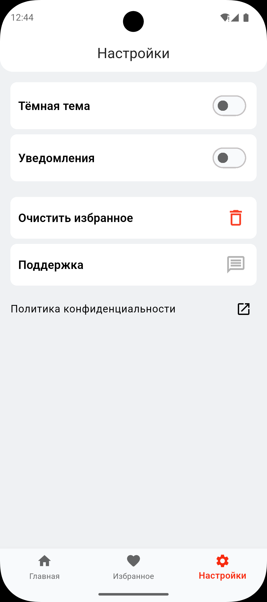
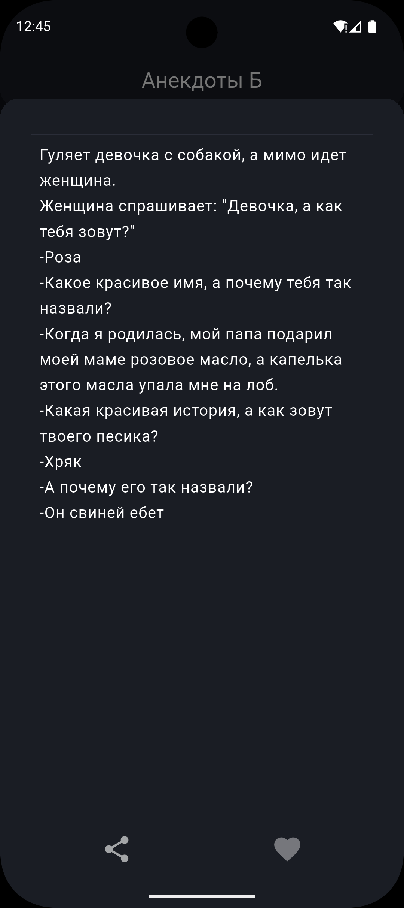
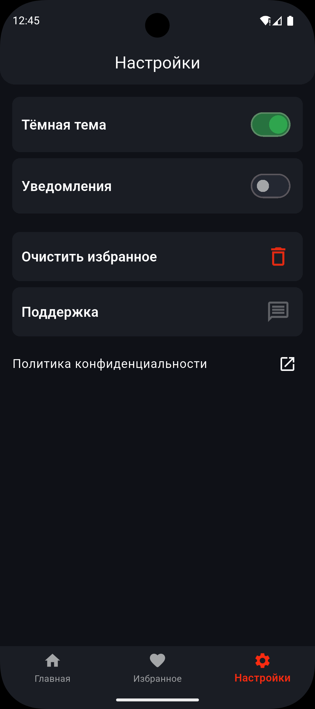

# 😂 Анекдоты Б

Flutter приложение с базой забавных анекдотов, сохранением избранного и push-уведомлениями.

> **Статус:** Beta | **Платформы:** Android, iOS | **Лицензия:** MIT License

## 🎯 Возможности

- 📚 **База анекдотов** — тысячи забавных анекдотов
- ⭐ **Избранное** — сохраняй любимые анекдоты локально (Hive)
- 🔔 **Push-уведомления** — Firebase Messaging
- ✏️ **Редактирование** — исправляй текст анекдотов
- 🌓 **Темная/светлая тема** — комфортное чтение в любое время
- ⚡ **Оптимизировано** — ~60 МБ, быстрая загрузка

## 📸 Скриншоты

### Светлая тема
| Главный экран | Анекдот | Избранное | Настройки |
|:---:|:---:|:---:|:---:|
|  |  |  |  |

### Темная тема
| Главный экран | Анекдот | Избранное | Настройки |
|:---:|:---:|:---:|:---:|
|  |  |  |  |

## 🚀 Быстрый старт

### Требования

- Flutter 3.38.9+
- Dart 3.10.7+
- Android SDK 21+ или Xcode 14+

### Установка

```bash
# Клонируй репозиторий
git clone https://github.com/renz1k/category_b.git
cd anekdots_b

# Установи зависимости
flutter pub get

# Сгенерируй код (BLoC, models, routes)
flutter pub run build_runner build

# Запусти приложение
flutter run
```

### Сборка

```bash
# Android APK
flutter build apk --release

# Android по архитектурам
flutter build apk --split-per-abi

# iOS
flutter build ios --release
```

## 📁 Архитектура

Проект использует **BLoC** для управления состоянием и модульную структуру:

```
lib/
├── app/                          # Главное приложение
├── core/
│   ├── di/                       # Dependency Injection
│   ├── theme/                    # Темы UI
│   └── utils/                    # Утилиты
├── feathures/                    # Модули приложения
│   ├── anekdots/                 # Список анекдотов
│   │   ├── bloc/
│   │   ├── models/
│   │   ├── pages/
│   │   └── widgets/
│   ├── favorites/                # Избранные
│   ├── settings/                 # Настройки
│   └── home/                     # Главный экран
├── main.dart
└── firebase_options.dart
assets/
├── images/
├── anekdots/                     # JSON с анекдотами
└── logo/
```

## 🔧 Технологический стек

| Категория | Библиотеки |
|-----------|-----------|
| **State Management** | BLoC, flutter_bloc |
| **Navigation** | Auto Route |
| **Local Storage** | Hive, SharedPreferences |
| **Backend** | Firebase Firestore, Messaging, Crashlytics |
| **Logging** | Talker |
| **Utilities** | Get It, Permission Handler |

## 📦 Зависимости

Смотри `pubspec.yaml` для полного списка. Основные:

- `flutter_bloc: ^9.1.1`
- `auto_route: ^11.1.0`
- `firebase_core: ^4.4.0`
- `cloud_firestore: ^6.1.2`
- `hive_ce: ^2.19.1`

## 💻 Разработка

### Добавить новую фичу

1. Создай папку в `lib/feathures/feature_name/`
2. Структура:
   ```
   feature_name/
   ├── bloc/          # BLoC классы
   ├── models/        # Data models
   ├── pages/         # UI страницы
   ├── widgets/       # Компоненты UI
   └── repositories/  # Работа с данными
   ```

3. Используй BLoC для состояния
4. Auto Route для навигации

### Сгенерировать код

```bash
# Сгенерировать код
flutter pub run build_runner build

# С удалением конфликтов
flutter pub run build_runner build --delete-conflicting-outputs

# Очистить
flutter pub run build_runner clean
```

### Линтинг

```bash
flutter analyze
```

## 🧪 Тестирование

```bash
# Запустить все тесты
flutter test

# С покрытием
flutter test --coverage
```

## 📚 Структура данных

### Firebase Firestore

```
anekdots/
├── id          (String)
├── text        (String)
├── category    (String)
└── createdAt   (Timestamp)
```

### Hive (локальное хранилище)

- **Favorites** — ID избранных анекдотов
- **Settings** — Настройки приложения (тема, язык)

## 🐛 Логирование и отладка

```bash
# Просмотр логов
flutter logs

# С фильтром
flutter logs | grep "anekdots"
```

**Firebase Crashlytics** автоматически отправляет ошибки:
1. Перейди в https://console.firebase.google.com/
2. Выбери проект → Crashlytics

## 📋 Требования

- **API Level:** Android 5.0+ (SDK 21)
- **iOS:** 12.0+
- **Интернет:** требуется для Firebase
- **Permissions:** INTERNET, POST_NOTIFICATIONS, VIBRATE

## 📝 Изменения

Смотри [CHANGELOG](CHANGELOG.md) для истории версий.

## 📄 Лицензия

MIT License — смотри [LICENSE](LICENSE) файл

Исходный код открыт. Ключи и конфиги (Firebase, signing keys) не включены в репо (`.gitignore`).

## 🤝 Контакты

- **Telegram:** [@banochkapivchika](https://t.me/banochkapivchika)
- **Email:** klaHip@yandex.ru
- **GitHub:** [renz1k](https://github.com/renz1k)

---

**Версия:** 1.0.0 | **Последнее обновление:** май 2026
